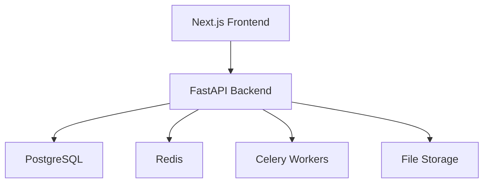

Career Support Workflow Platform
- Helping applicants become interview- and application-ready through resume reviews, mock interviews, structured feedback, and human support.

:sparkles: Overview
This project is a career support workflow platform built for

- students
- early professionals / first jobber
- scholarship applicants
- non-native English speakers
- communities and volunteer mentor networks
- Instead of focusing only on resume building or AI interview practice, this platform is designed to support the full workflow between applicants, mentors, and coordinators.

:seedling: Why This Project

Many people do not lack motivation. They lack access to structured support.

Career help is often scattered across chat messages, informal volunteer help, isolated resume reviews, and one-off mock interviews. This project turns that fragmented process into a system that is easier to manage, scale, and improve.

It is inspired by a real volunteer effort involving people with teaching and HR backgrounds who help others with resumes and interview preparation.

:rocket: Highlights

- multi-role workflow for applicants, mentors, and coordinators
- resume review request system
- mock interview scheduling and feedback
- structured support tracking over time
- admin dashboard for operations and outcomes
- background jobs for reminders and notifications
- portfolio-ready full-stack architecture

:gear: Core Features

- Applicant Experience
create a profile and define support goals
upload a resume and request feedback
book mock interview sessions
view feedback history and progress

- Mentor Experience
manage availability
review resumes
run mock interviews
submit structured feedback

- Coordinator Experience
manage incoming requests
assign mentors or reviewers
monitor queues and activity
track outcomes across the platform

- User Roles
Role	Responsibilities
   - Applicant:	Requests support, uploads documents, books sessions, and tracks feedback
   - Mentor / Reviewer:	Reviews resumes, provides feedback, and conducts mock interviews
   - Coordinator / Admin:	Manages requests, assigns mentors, monitors queues, and tracks platform activity

:hammer_and_wrench: Tech Stack
Layer	Technology
- Frontend:	Next.js
- Backend:	FastAPI
- Database:	PostgreSQL
- ORM: Prisma
- Queue / Background Jobs:	Celery + Redis
- Caching:	Redis
- File Storage:	S3-compatible storage
- Deployment:	Vercel + Render / Railway / Fly.io

:building_construction: Architecture

:world_map: Roadmap

- Phase 1: Foundation
project setup
authentication
role-based access
database schema and migrations

- Phase 2: Resume Review Workflow
applicant profiles
resume upload
review request workflow
mentor assignment

- Phase 3: Mock Interview Workflow
mentor availability
mock interview booking
structured interview feedback

- Phase 4: Operations and Deployment
coordinator dashboard
analytics
notifications and reminders
production deployment

:construction: Project Status
Planning / Setup

- Next Steps
finalize the project name
create wireframes
define the database schema
scaffold frontend and backend apps
implement the resume review workflow first

- Long-Term Direction
The goal is to build more than a resume tool. This project aims to support a real community-based career support model that can be used by small teams, volunteer networks, clubs, and career support initiatives.

- Notes
built as a portfolio-ready full-stack system
emphasizes real user flows, backend engineering, database design, async jobs, and deployment
detailed planning documents can be added under docs/ as the project grows
